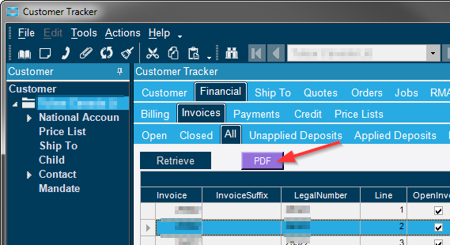
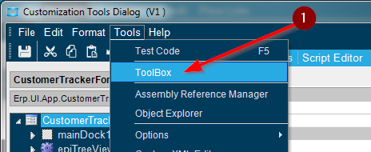
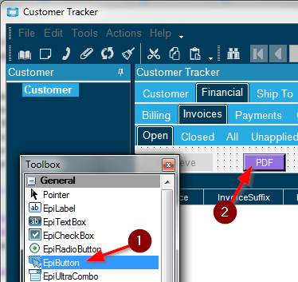
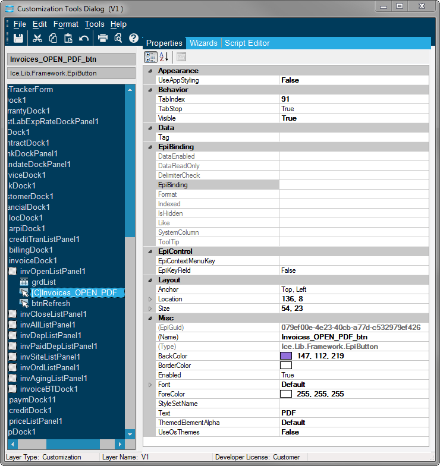
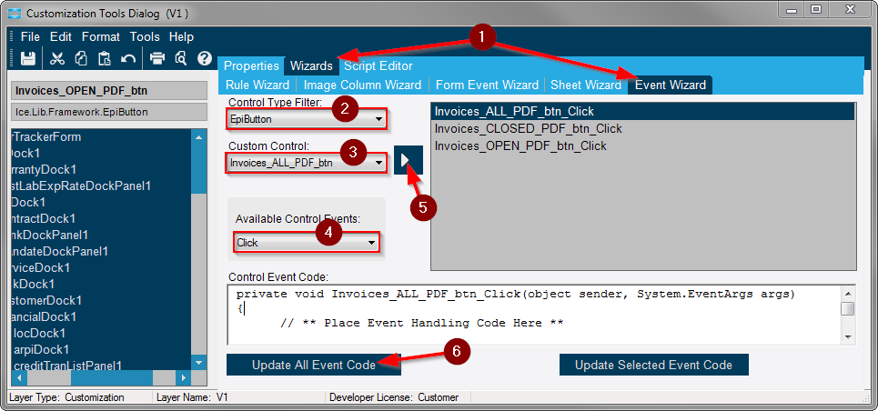
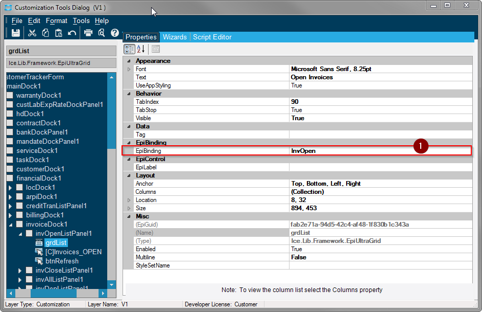
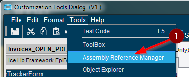
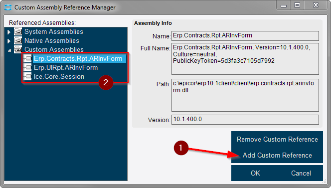
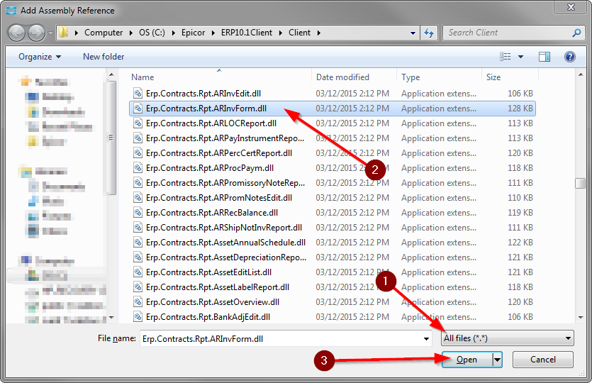
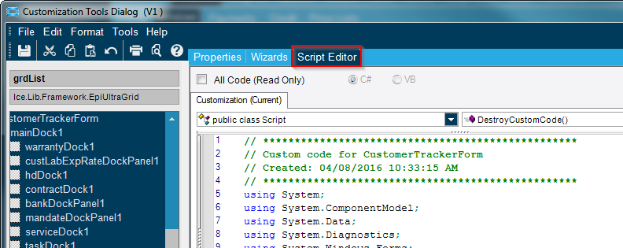

# PrintPreviewFromAnywhere
This customization allows you automatically print preview a document without having to open it first. In this example we print preview invoices from directly within customer tracker with a button click. There is no need to open invoice entry to be able to preview the invoice.

#### Steps to Customize the Print Preview buttons are:

1. Add buttons to the customer tracker screen using the toolbox menu.
2. Add Button Click Events that trigger custom code when a user clicks the button.
3. When the button is pressed, Epicor knows which invoice you have highlighted in customer tracker. This is done using EpiDataViews. EpiDataView functions can return which invoice is currently highlighted in the invoice list grid.
4. The invoice number is automatically previewed as a pdf. This is done using the AR Invoice Adapter. The AR Invoice Adapter has functions that allow you to preview an invoice. By passing the highlighted invoice number to the AR Invoice Adapter functions, we can have it automatically preview the highlighted invoice as a PDF.

#### Navigate to this program from the Main Menu:

_Sales Management > Customer Relationship Management > General Operations > **Customer Tracker**_ 

Make sure you have developer mode turned on so you can begin customizing the Customer Tracker Screen. 

#### Step 1 - Create the Buttons

1. Once you have opened the Customization screen, click the Tools dropdown and select Toolbox.

1. Select EpiButton from the Toolbox.
2. Drag out the button to the size you need.

Create one button for each tab; _Open, Closed and All._

- you can modify the look of the button by changing it's properties.

#### Step 2 - Create Button Click Events

1. From the Customization Window navigate to the Event Wizard Tab.
2. Set the Control Type Filter to EpiButton.
3. For the Custom Control select one of your custom buttons you created in step 1.
4. For the Available Control Events select Click.
5. Now Add this event by clicking the right arrow.
6. After click the Update All Event Code button to automatically add the custom code to the Script Editor.

#### Step 3 - Use Epidataviews

1. When you click the PDF Preview button you want it to preview the invoice number you have highlighted in the grid below. You must determine what the name of the grid is so you can reference it in your EpiDataView function. To determine the name of the grid, highlight it, and view it's name in the properties window under EpiBinding. Make note of the names of all three grids. One for each button. You will need this later on when you begin entering your own custom code in the Script Editor.

1. Open the Assembly Reference Manager window.

1. By clicking the Add Custom Reference button a search window will open.
2. You will need to search for the following three Custom Assemblies.

1. Change the filter so you can see All Files.
2. Look for one of the three Custom Assemblies and highlight it.
3. Click Open to add that Custom Assembly. Repeat these 3 steps to add all the Custom Assemblies.

You can now begin adding custom code to the Script Editor.

